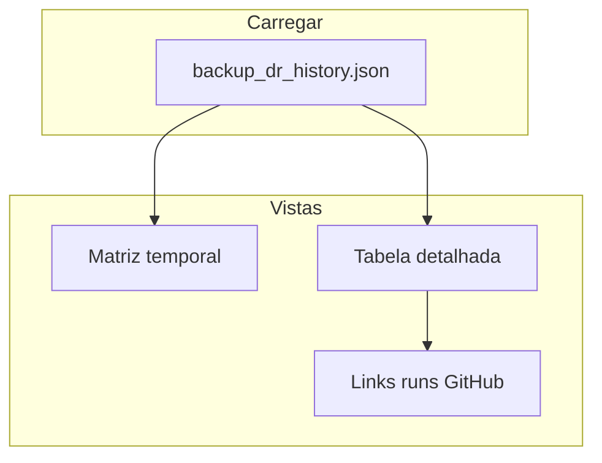

# 04 — Desenho lógico — E17.1 Autonomia e Resiliência Cloud Total

**Demanda:** `2026-04-09_E17_1_autonomia_resiliencia_cloud`  
**Fase:** **B (Desenho lógico Cloud)**  
**Data:** 2026-04-09  

Este documento define a **infraestrutura alvo** (GitHub Actions, segredos, fluxo de dados), o **ciclo de restore de prova**, o **ficheiro canónico de telemetria** consumido pelo Monitor de Voo e o **esquema visual** da nova aba — **antes** de qualquer implementação.

---

## 1. Restrição física dos runners GitHub (premissa de arquitectura)

Os **runners alojados pela GitHub** (`ubuntu-latest`, etc.) **não** têm acesso ao `data/beaba_gestao.db` da instalação local. Por conseguinte, **uma de** estas estratégias (ou combinação) é **obrigatória** para cumprir «backup horário na nuvem» com dados reais:

| Estratégia | Descrição | Risco / custo |
|:---|:---|:---|
| **S1 — Runner auto-hospedado** | Etiqueta `runs-on: [self-hosted, beaba-backup]` com volume ou caminho sincronizado onde reside a cópia quente da base (reutiliza lógica E17 ou mount SMB/NFS). | Operação do runner; segurança do host. |
| **S2 — Ingestão por object storage** | Um agente mínimo (não-Windows possível: Linux/container) corre **fora** do GHA e envia ficheiro `.db` (ou já encriptado) para **S3 / Azure Blob / GCS**; o workflow **horário** em GHA apenas **puxa** o último objecto, **re-encripta** se necessário, publica artefacto/release e regista telemetria. | Custos de bucket; IAM/OIDC. |
| **S3 — `repository_dispatch`** | Cron externo (VM, Cloud Scheduler) com segredo dispara `workflow_dispatch` / `repository_dispatch` com **payload** (URL assinada do blob) para o GHA processar. | Mais peças móveis; bom para ambientes híbridos. |

**Recomendação da EQUIPE para «Cloud Total»:** **S2 + GHA** como núcleo: o **GitHub Actions** torna-se a **fonte de verdade do pipeline** (encriptação, metadados, restore de prova, telemetria); a **captura** do `.db` continua a ser **perto dos dados** (agente lean ou runner auto-hospedado), **sem** depender do Task Scheduler Windows como único caminho.

**Documentação obrigatória no PAINEL (Fase F):** diagrama «dados → bucket → GHA → artefacto frio» e checklist de credenciais (sem segredos no repositório).

---

## 2. Sincronia com `develop`

Todos os workflows que leem código ou esquema do repositório devem:

```yaml
# Extracto normativo (implementação futura)
- uses: actions/checkout@v4
  with:
    ref: develop
    fetch-depth: 0
```

- **Backup horário:** sempre compilar/executar scripts a partir do **HEAD de `develop`** no momento do `checkout`.  
- **Restore semanal:** idem; a validação de **estrutura de tabelas** compara o SQLite restaurado contra **lista canónica** versionada em `develop` (ex.: ficheiro gerado ou `schema_version` + migrações esperadas).  
- **Proteção de branch:** `develop` não deve aceitar push que quebre workflows de DR sem aviso (já alinhado com CI existente).

---

## 3. Workflow — Backup horário (24/7/365)

| Aspecto | Decisão |
|:---|:---|
| **Gatilho** | `on: schedule: - cron: '37 * * * *'` (UTC, minuto 37 de cada hora). Ajuste documentado se RPO tiver de ser «relógio local». |
| **Runner** | `ubuntu-latest` **se** S2 (só processa blob remoto); **self-hosted** se S1 (lê disco local). |
| **Passos lógicos** | 1) `checkout` **develop**. 2) Obter ficheiro de dados (download S3 OIDC / artefacto anterior / path mount). 3) `PRAGMA quick_check` na cópia de trabalho **antes** de encriptar. 4) Encriptar AES-256-GCM (§4). 5) Publicar **GitHub Artifact** nomeado com timestamp + opcionalmente **Release** mensal ou mirror para bucket frio (retenção > 90 d). 6) Escrever entrada em telemetria (§6). 7) Falha em qualquer passo crítico ⇒ job falha + entrada ❌ na telemetria. |
| **RPO ~1 h** | Um artefacto **bem-sucedido** por hora; retenção mínima documentada (ex.: 168 horas espelhadas no desenho E17). |
| **Segredos** | `BACKUP_AES_KEY` (32 bytes, base64 ou hex); credenciais cloud (`AWS_ROLE_ARN` + OIDC, ou equivalente); **nunca** em claro no repo. |

---

## 4. Criptografia AES-256-GCM

| Campo | Especificação |
|:---|:---|
| **Algoritmo** | AES-256-GCM (`cryptography.hazmat` em Python **ou** `openssl enc -aes-256-gcm` com AAD fixo — preferência **Python** partilhado com restore). |
| **Chave** | 256 bits, armazenada em **GitHub Secret**; rotação manual documentada (nova chave + re-backup completo). |
| **Nonce / IV** | 12 bytes aleatórios **por ficheiro** e por execução; pré-fixados ao ficheiro de saída (cabecalho claro: magic + versão + nonce + tag). |
| **AAD (opcional)** | Metadados não-secretos: `repo`, `commit_sha`, `workflow_run_id` — para ligar blob a proveniência. |
| **Formato ficheiro** | `.beaba.enc` (binário) + manifest JSON lado a lado **ou** cabecalho binário versionado (documentar no código). |

**Fluxo:** plaintext `.db` (ou gzip opcional **antes** de AES para reduzir custo de armazenamento) → **GCM** → upload artifact/release.

---

## 5. Workflow — Restore semanal (prova automática)

| Passo | Acção |
|:---:|:---|
| 1 | `checkout` **develop**. |
| 2 | Resolver «último backup bom»: preferência **último artefacto** da workflow de backup **com sucesso**; fallback URL de object storage. |
| 3 | Descarregar + **decriptar** (mesma chave / versão de formato). |
| 4 | `PRAGMA integrity_check` + `PRAGMA foreign_key_check`. |
| 5 | **Validação de estrutura:** lista de tabelas esperada (ficheiro em repo, ex. `docs/governanca/telemetry/expected_tables.txt` ou gerado a partir de `connection.py` / migrações — decisão na Fase C). |
| 6 | **Evidências físicas:** `sha256` do ficheiro decifrado; contagens `SELECT COUNT(*)` por tabela núcleo (lista configurável: `clientes`, `vendas`, …). |
| 7 | Anexar ao output: ficheiro JSON de evidências (§6) + link `html_url` do **run** do GitHub. |
| 8 | **Não** publicar dados pessoais em logs públicos — apenas contagens agregadas e checksums. |

**Agendamento:** `cron` semanal (ex.: `0 4 * * 0` UTC) + `workflow_dispatch` manual para ensaio.

---

## 6. Telemetria canónica (histórico JSON)

**Caminho proposto (versionado em `develop`):**  
`docs/governanca/telemetry/backup_dr_history.json`

**Política de escrita:** o workflow (job com `contents: write` e **GITHUB_TOKEN** ou **PAT** limitado) faz **commit** de um único ficheiro JSON **ou** anexa **artifact** `telemetry.json` e um processo de consolidação periódico faz merge — **preferência Fase C:** um commit por restore semanal + append estruturado por hora via **rebase** ou ficheiro **JSONL** `backup_dr_runs.jsonl` mais simples para append.

**Esquema lógico (v1)** — array `runs` ordenado por `started_at` descendente:

```json
{
  "schema_version": 1,
  "runs": [
    {
      "id": "gha-12345-backup-20260409120000",
      "type": "backup|restore_proof",
      "started_at": "2026-04-09T12:00:05Z",
      "finished_at": "2026-04-09T12:01:40Z",
      "duration_seconds": 95,
      "git_ref": "develop",
      "git_sha": "abc123…",
      "workflow_run_url": "https://github.com/org/repo/actions/runs/…",
      "log_url": "https://github.com/org/repo/actions/runs/…/job/…",
      "groups": {
        "ambiente": { "status": "ok|warn|fail", "detail": "runner ubuntu-22.04; Python 3.12" },
        "estrutura": { "status": "ok", "detail": "paths repo; checkout develop" },
        "configuracao": { "status": "ok|warn|fail", "detail": "secrets presentes: AES, OIDC" },
        "arquivos": { "status": "ok|warn|fail", "detail": "static assets checksum opcional" },
        "user_data": { "status": "ok|warn|fail", "detail": "quick_check ok; sha256=…; rows: clientes=42" },
        "logs": { "status": "ok|warn|fail", "detail": "link acima; exit 0" }
      }
    }
  ]
}
```

**Mapeamento de ícones (UI):** `ok` → ✅, `warn` → ⚠️, `fail` → ❌.

---

## 7. Dashboard — aba «Controle de Backup e Restore» (`monitor_governanca.py`)

**Localização:** nova **aba** Streamlit (`st.tabs`) na shell do monitor: **«Governança»** (actual) | **«Backup e Restore»**.

### 7.1 Fonte de dados

- Ler `docs/governanca/telemetry/backup_dr_history.json` (ou `.jsonl` acordado) da **raiz do clone**, com tolerância a ficheiro ausente (estado vazio ⚪).

### 7.2 Matriz temporal (Ano / Mês / Dia / Hora)

- **Eixo:** últimas **N** execuções (ex.: 168) ou calendário **últimos 7 dias × 24 h**.  
- **Célula:** cor / ícone derivado do **pior** `status` entre os seis grupos (fail > warn > ok).  
- **Tooltip / expander:** `duration`, `git_sha`, links clicáveis para `workflow_run_url` e `log_url`.

### 7.3 Tabela por execução

| Coluna | Conteúdo |
|:---|:---|
| Início / Fim / Duração | ISO + humanizado |
| Tipo | backup / restore_proof |
| Ambiente … Logs | Seis colunas com ✅⚠️❌ |
| Evidências | checksum, contagens (restore apenas) |

### 7.4 Fluxo de UI (Mermaid)



---

## 8. Restore total «do zero» (objectivo final)

Checklist lógico (documentação + automação parcial):

1. Clonar repo, checkout `develop`.  
2. Restaurar **`.env`** a partir de gestor de segredos (1Password / Vault) mapeando **`.env.example`**.  
3. Descarregar último `.beaba.enc` + decriptar com chave recuperada de forma segura.  
4. Colocar `data/beaba_gestao.db` + `pip install -r requirements.txt` (pinagem em `requirements.txt` validada no grupo **Ambiente**).  
5. `streamlit run app.py` smoke + `pytest` opcional em CI local.  

O workflow **restore semanal** prova os passos **2–4** em ambiente efémero **exceto** segredos humanos fora do GitHub.

---

## 9. Dependências e ficheiros novos (Fase C — não executar agora)

| Artefacto | Notas |
|:---|:---|
| `.github/workflows/backup-hourly.yml` | Schedule + checkout develop. |
| `.github/workflows/restore-weekly.yml` | Schedule + evidências. |
| `scripts/e17_1_encrypt_db.py` / `decrypt_db.py` | Partilhado GHA e local. |
| `docs/governanca/telemetry/backup_dr_history.json` | Inicial `{"schema_version":1,"runs":[]}` commitado uma vez. |
| `monitor_governanca.py` | `st.tabs` + renderizador da matriz. |
| `tests/test_backup_telemetry_schema.py` | Validação do JSON vs schema mínimo. |

---

## 10. Critérios de aceite (implementação futura)

- [ ] Backup horário em GHA com **checkout explícito** de `develop` e registo de `git_sha` na telemetria.  
- [ ] Artefactos encriptados AES-256-GCM; chave só em Secrets.  
- [ ] Restore semanal: `integrity_check`, estrutura de tabelas, checksum, contagens, URLs de run.  
- [ ] Monitor: aba dedicada com matriz + grupos + links.  
- [ ] Documentação PAINEL + `.env.example` actualizado para variáveis **não-secretas** necessárias ao DR.  
- [ ] `pytest` verde; §7 em cada PC.

---

## 11. Pedido ao Diretor

Após revisão deste **04**, confirmar com **PROSSIGA** para a EQUIPE implementar workflows, scripts de criptografia, telemetria e aba do Monitor.
